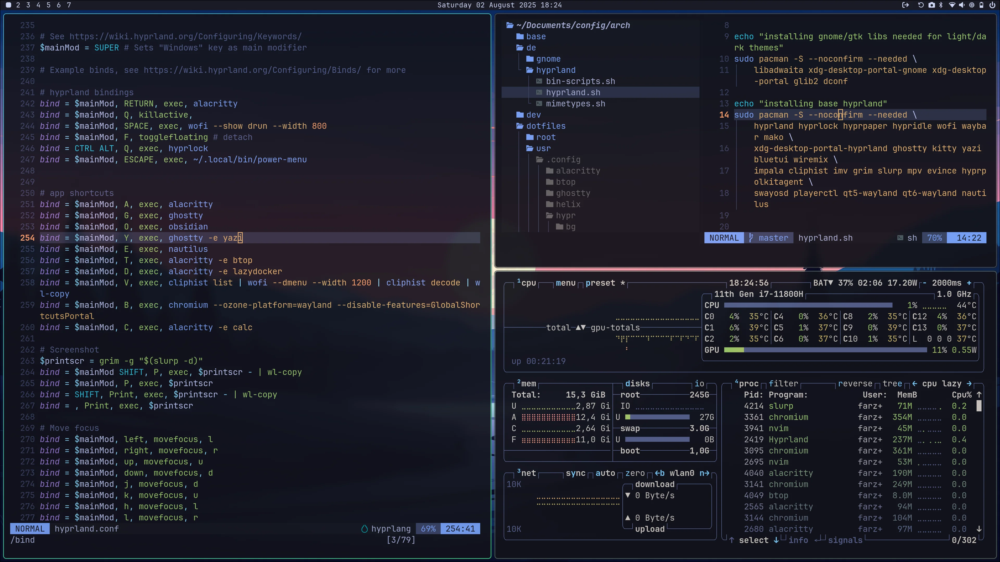

# Hyprlandとは

こんにちは！今回は、Linux界隈で今最も熱い視線を集めているデスクトップ環境（正確にはWaylandコンポジタ）、「**Hyprland（ハイパーランド）**」について解説します。

「Linuxのデスクトップをカッコよくしたい」「キーボード操作を極めたい」という方は必見です。Windowsの操作感と何が違うのか、そしてどのような技術が使われているのか、わかりやすく紐解いていきます。

---

## 1. Hyprlandとは何か？

一言でいうと、Hyprlandは**「圧倒的に美しく、滑らかに動く『タイル型』のウィンドウマネージャー」**です。

Linuxの世界では、画面の描画やウィンドウの管理方法を自分好みに選択できます。その中でもHyprlandは、最新の画面描画システムである「Wayland」をベースにしており、以下のような特徴を持っています。

- **ヌルヌル動くアニメーション:** ウィンドウを開く、閉じる、移動するときの動きが非常に滑らかです。
- **リッチな視覚効果:** 背景のすりガラス効果（ブラー）や、ウィンドウの角丸、美しい影が標準でサポートされています。
- **高いカスタマイズ性:** 設定ファイルを1つ書き換えるだけで、自分だけの理想のデスクトップ環境を構築できます。

これまで「タイル型ウィンドウマネージャーは玄人向けで見た目が地味」という常識がありましたが、Hyprlandはその常識を見事に打ち破りました。

---

## 2. Windowsの画面管理と何が違うの？

Windowsを使っていると当たり前に感じる操作も、Hyprland（タイル型）では全く異なります。決定的な違いは以下の2点です。

### ① 「重ねる（フローティング）」か「敷き詰める（タイル）」か
- **Windows（スタック型）:** ウィンドウはトランプのように**重なり合います**。マウスで端をつまんでサイズを変えたり、ドラッグして移動させたりするのが基本です。
- **Hyprland（タイル型）:** ウィンドウはタイルのように**画面に敷き詰められます**。新しいアプリを開くと、既存のウィンドウが自動的にリサイズされ、画面を分割して配置されます。ウィンドウ同士が重なって後ろが見えなくなる、といったストレスがありません。




### ② 「マウス中心」か「キーボード中心」か
Windowsではマウス操作が主役ですが、Hyprlandは**キーボード中心（キーボード・ドリブン）**で操作するように設計されています。
ショートカットキー（例えば `Superキー + Enter` で端末起動、`Superキー + 方向キー` で移動など）を使うだけで、一瞬にして操作が完了します。マウスに手を伸ばす回数が劇的に減るため、プログラミングや執筆作業の効率が爆発的に向上します。

---

## 3. Hyprlandの技術仕様・ディープな魅力

少し技術的な踏み込んだお話をすると、Hyprlandの凄さはその「設計」にあります。

### 最新プロトコル「Wayland」の採用
従来、Linuxのデスクトップは「X11」という数十年前からある古いシステムに依存していました。しかしHyprlandは、次世代のディスプレイサーバープロトコルである**Wayland**専用に作られています。
これにより、画面のチラつき（ティアリング）がなくなり、マルチモニター環境や高リフレッシュレート（144Hzなど）でも極めて安定して高速に動作します。

### C++による開発と独自レンダラー
HyprlandはC++で書かれています。かつては`wlroots`という汎用ライブラリを使用していましたが、現在では自前のレンダラー・バックエンドである「**Aquamarine**」へ移行するなど、独自の進化を遂げています。これにより、GPUの力をフル活用した複雑なカスタムアニメーションを低負荷で実現しています。

### 強力なIPC機能と拡張性
技術者にとって嬉しいのが、強力なIPC（プロセス間通信）の仕組みです。
`hyprctl` というコマンドラインツールを使って、外部のスクリプトからHyprlandを直接操作できます。

```bash
# 例：現在のウィンドウにブラーをかける設定を動的に変更する
hyprctl keyword decoration:blur:enabled true
```

このように、「特定のアプリが開いたら、自動で指定のワークスペースに移動させる」といった複雑な自動化も、シェルスクリプトで簡単に実装可能です。

---

## 4. どんな人におすすめ？
Hyprlandは、以下のような方に強くおすすめできるデスクトップ環境です。

*   **キーボード操作の効率を極限まで高めたい人**
*   **SF映画に出てくるような、スタイリッシュなPC環境を作りたい人**
*   **Linuxのカスタマイズの奥深さを味わいたい人**

導入にはLinuxの基礎知識や設定ファイルを編集する根気が必要ですが、一度その快適さと美しさを味わうと、もう元のデスクトップには戻れなくなる魅力を持っています。