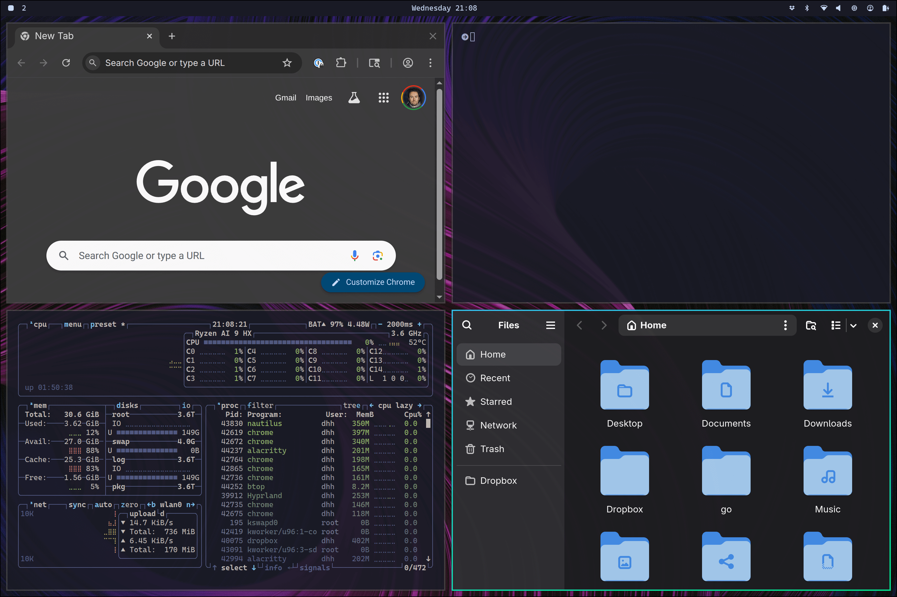

## Omarchyとは

Omarchy(オマーキー)とは、Ruby on Railsを作ったDHHが開発したプログラマー向けOSです。

Omarchyの名前の由来は日本語のおまかせ（Omakase） + ArchでOmarchyです。
（Arch Linux：ベースになっているLinux OS）

(Omakase + Arch がOmarchyになるの、日本人の感覚から言うとちょっと変ですが・・・笑)

Ruby on Railsも"Rails is Omakase"といわれていて、DHHの考えるWeb開発に必要なおすすめセットになっています。

つまり、OmarchyはDHHという方が考えた、プログラマーにとって必要な設定やソフトだけを集めた、ぼくの考えた最強のOSということです。

公式サイトのリンクは以下の通りです。

- [Omarchy公式](https://omarchy.org/)

## Omarchyの魅力

### 1. タイル型ウィンドウマネージャー
Omarchyは標準でタイル型ウィンドウマネージャー(Hyprland)を搭載しています。

これによってマウスを使うことなく、キーボードだけでウィンドウを扱うことができます。

### 2. 環境構築が「おまかせ」で一瞬で終わる
通常、Arch LinuxやHyprlandを一からセットアップしようとすると、黒い画面とにらめっこしながら大量の設定ファイル（ドットファイル）を書き換える必要があります。これは非常に時間がかかり、初心者にはハードルが高い作業です。

しかし、Omarchyならまさに「おまかせ」。DHHが選び抜いた最高の開発環境（ターミナル、エディタ、フォントなど）が、自動的にインストール・設定されます。OSを入れたその日から、煩わしい設定なしにすぐにコーディングに集中できるのが最大のメリットです。

### 3. Arch Linuxベースによる最新パッケージの恩恵
ベースがArch Linuxであるため、常に最新のソフトウェアを利用できる「ローリングリリース」の恩恵を受けられます。
他のOSでありがちな「欲しいツールのバージョンが古くて、わざわざ別のリポジトリを追加する」といった手間が省けます。AUR（Arch User Repository）の強力なパッケージ群も利用できるため、開発に必要なツールが手に入らないということはまずありません。

### 4. 洗練されたターミナル環境
Omarchyでは、マウスを使わないキーボード中心の操作（TUI）が極められています。
高速なターミナルエミュレータと、モダンにカスタマイズされたNeovimなどがシームレスに連携します。見た目も美しく整えられており、毎日コードを書くのが楽しくなるような洗練されたデザインに仕上がっています。

## Omarchyは誰におすすめ？

*   **設定の沼から抜け出したい人:** 自分のドットファイルを育てるのに疲れた、あるいはプロの考えた「正解の環境」にそのまま乗りたい人。
*   **キーボードだけでスタイリッシュに操作したい人:** Hyprlandなどのタイル型ウィンドウマネージャーに憧れがあるけれど、初期設定の難しさで挫折した経験がある人。
*   **最新のツールを常に追いかけたい人:** Arch Linuxの強みである最新パッケージの恩恵を受けつつ、安定した開発環境を手っ取り早く構築したい人。
*   **OS環境を変えたい人:** スペック的にWindows11にできなかった人や、今のありきたりなOSに飽きてしまった人。

## まとめ

DHHの哲学が詰まった「Omarchy」は、開発者が本来やるべき「コードを書くこと」に集中させてくれる素晴らしい環境です。
「設定作業よりも開発を進めたい」「でもカッコいい環境で作業したい」という方は、ぜひ一度その「おまかせ」な使い心地を体験してみてはいかがでしょうか？